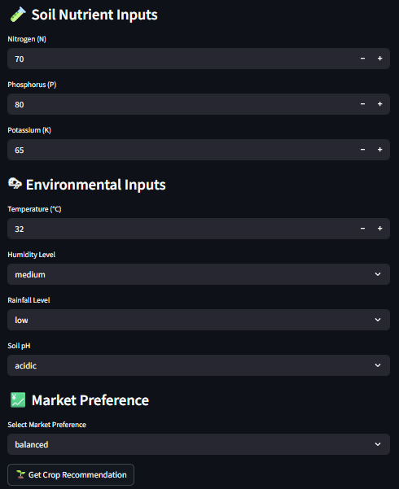
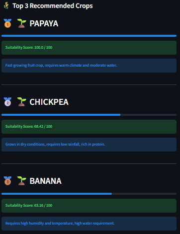

# 🌾 Farmer Crop Recommendation System

## Overview

The Farmer Crop Recommendation System is a machine learning-powered web application that recommends suitable crops based on soil and environmental conditions.

The system utilizes agricultural parameters such as Nitrogen (N), Phosphorus (P), Potassium (K), temperature, humidity, pH, and rainfall to predict the most suitable crop for cultivation.

The project was developed using Python, Scikit-learn, and Streamlit, with a Random Forest classifier serving as the predictive model.

---

## Features

* Crop recommendation based on environmental conditions
* Machine Learning-based prediction using Random Forest
* Interactive Streamlit web application
* Real-time prediction generation
* Data preprocessing and feature engineering
* Modular project architecture

---

## Dataset

The dataset contains over **2,200 agricultural records** with the following features:

| Feature        | Description                |
| -------------- | -------------------------- |
| Nitrogen (N)   | Nitrogen content in soil   |
| Phosphorus (P) | Phosphorus content in soil |
| Potassium (K)  | Potassium content in soil  |
| Temperature    | Temperature in °C          |
| Humidity       | Relative humidity (%)      |
| pH             | Soil pH level              |
| Rainfall       | Rainfall in mm             |

### Target Variable

* Recommended Crop

---

## Technologies Used

* Python
* Pandas
* NumPy
* Scikit-learn
* Streamlit
* Joblib

---

## Project Structure

```text
crop-recommendation-system/
│
├── app.py
├── recommender.py
├── crop_model.pkl
├── label_encoder.pkl
├── requirements.txt
├── README.md
│
├── algorithms/
├── data/
├── models/
├── utils/
│
└── images/
    ├── input_interface.png
    └── output_interface.png
```

---

## Model Information

**Algorithm:** Random Forest Classifier

The model was trained on 2,200+ agricultural records and used to recommend crops based on environmental and soil parameters.

---

## Application Preview

### Input Interface



### Prediction Output



---

## Installation

Clone the repository:

```bash
git clone https://github.com/SoumyMittal/crop-recommendation-system.git
```

Navigate to the project directory:

```bash
cd crop-recommendation-system
```

Install dependencies:

```bash
pip install -r requirements.txt
```

Run the Streamlit application:

```bash
streamlit run app.py
```

---

## Future Improvements

* Support for additional crops and datasets
* Weather API integration
* Fertilizer recommendation module
* Soil health analysis
* Mobile-friendly deployment

---

## Author

**Soumy Mittal**

B.Tech Artificial Intelligence & Data Science
Amrita Vishwa Vidyapeetham

### Interests

* Machine Learning
* Data Science
* Computer Vision
* Scientific Computing
* Embedded Systems & IoT
